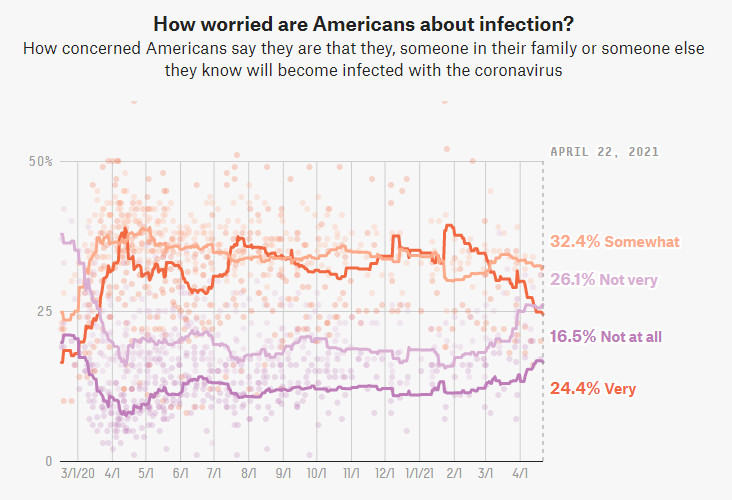

# Original Graphic
```{r,  echo=FALSE, fig.align='center'}

```
Chart is frozen as of April 22, 2021


# Replication attempt Graphic
```{r,  echo=FALSE, fig.align='center'}
knitr::include_graphics("docs/ReplicatePlot.PNG")
```


# Source Target Visualization and Data

FiveThirtyEight's Article: ["How Americans View Biden's Response To The Coronavirus Crisis"](https://projects.fivethirtyeight.com/coronavirus-polls/) 

Data accessible from button below the graphic. ["HERE"](https://github.com/fivethirtyeight/covid-19-polls/archive/master.zip)   

# Data wrangling in R

## Loading libraries:
```{r warning=FALSE}
library(tidyverse)
library(broom)
library(readr)
```
## Import CSV files from FiveThirtyEight and make into objectes:

```{r}
CovidConcern<- read_csv("docs/data/covid-19-polls-master/covid_concern_polls.csv")
summary(CovidConcern)

```
## Covid Concern Data
Selected data. set end_date as x axis. Plot points for each concern level

```{r warning=FALSE}
ConcernedDots<-CovidConcern%>%
  select(end_date, very, somewhat, not_very, not_at_all)%>%
  ggplot(aes(x=end_date))+
  scale_y_discrete(breaks = c("0","25","50"))+
  geom_jitter(aes(y=very), color="red", alpha=1/10)+
  geom_jitter(aes(y=somewhat), color="orange", alpha=1/10)+
  geom_jitter(aes(y=not_very), color="blue", alpha=1/10)+
  geom_jitter(aes(y=not_at_all), color="purple", alpha=1/10)

```

Add lines? Try stat_smooth
```{r warning=FALSE}
CovidConcern%>%
  select(end_date, very, somewhat, not_very, not_at_all)%>%
  ggplot(aes(x=end_date))+
  geom_point(aes(y=very), color="red", alpha=1/10)+
  geom_point(aes(y=somewhat), color="orange", alpha=1/10)+
  geom_point(aes(y=not_very), color="blue", alpha=1/10)+
  geom_point(aes(y=not_at_all), color="purple", alpha=1/10)+
  stat_smooth(aes(y=very), color="red",method = "lm")+
  stat_smooth(aes(y=somewhat), color="orange",method = "lm")+
  stat_smooth(aes(y=not_very), color="blue",method = "lm")+
  stat_smooth(aes(y=not_at_all), color="purple",method = "lm")

```

Not the right lines... Try adjusting axis scales and then mean lines?
Try using stat_summary to get means.
```{r warning=FALSE}
Viz.Fig<-CovidConcern%>%
  select(end_date, very, somewhat, not_very, not_at_all)%>%
  filter(end_date>"2020-03-01", end_date<"2021-04-01")%>%
  ggplot(aes(x=end_date))+
  geom_point(aes(y=very), color="red", alpha=1/10)+
  geom_point(aes(y=somewhat), color="orange", alpha=1/10)+
  geom_point(aes(y=not_very), color="blue", alpha=1/10)+
  geom_point(aes(y=not_at_all), color="purple", alpha=1/10)+
  labs(title = "How worried are Americans about the Economy?", subtitle = "How concerned Americans say they are about the coronavirus's effect on the U.S. economy")+
  theme(axis.title.x= element_blank(), axis.title.y= element_blank())+
  scale_y_continuous(breaks = c(0,25,50,75), labels = function(x) paste0(x * 1, '%'))+
  scale_x_date(date_breaks = "1 month", date_labels = "%m/%d")+
  stat_summary(aes(y=very),fun="mean", color="red", geom="line", size=1)+
  stat_summary(aes(y=somewhat),fun="mean", color="orange", geom="line", size=1)+
  stat_summary(aes(y=not_very),fun="mean", color="blue", geom="line", size=1)+
  stat_summary(aes(y=not_at_all),fun="mean", color="purple", geom="line", size=1)

```

Close!
But still not as clean as the original graphic.
Also not clear on how to add a legend for the lines...